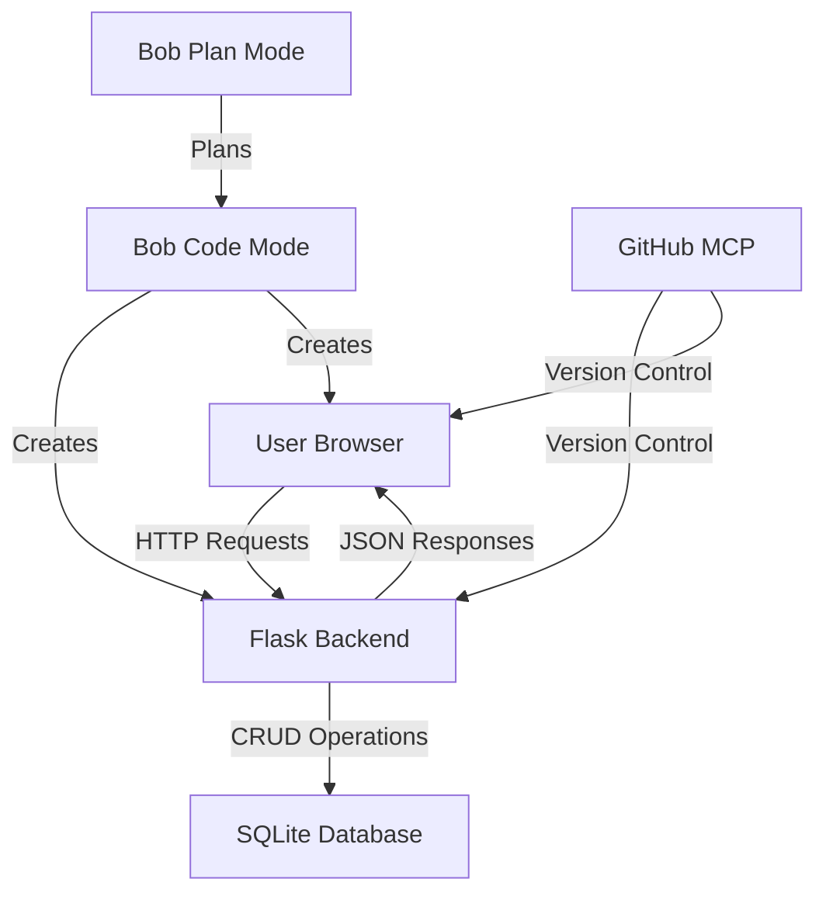
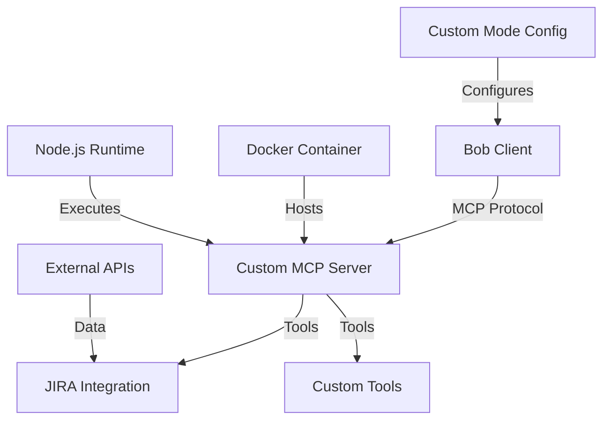
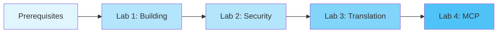

# Bob Bootcamp Labs - Architecture & Design Document

## Overview
This document outlines the architecture and design for a comprehensive hands-on lab series introducing IBM Bob's features through practical exercises. The bootcamp consists of 4 progressive labs covering beginner to advanced topics.

## Project Structure

```
bootcamp_intro_lab/
├── README.md                          # Main overview and navigation
├── ARCHITECTURE.md                    # This file
├── LAB_OVERVIEW.md                    # Visual overview
├── BOB_INSIGHTS.md                    # Productivity insights
├── prerequisites.md                   # Setup requirements
├── .gitignore                         # Git exclusions
├── lab1/                              # Building Applications
│   ├── README.md                      # Lab 1 instructions
│   ├── starter/                       # Starting point files
│   │   └── .gitkeep
│   ├── solution/                      # Complete solution
│   │   ├── backend/
│   │   │   ├── app.py
│   │   │   ├── requirements.txt
│   │   │   ├── models.py
│   │   │   └── database.py
│   │   └── frontend/
│   │       ├── index.html
│   │       ├── styles.css
│   │       └── app.js
│   └── assets/                        # Screenshots, diagrams
│       └── architecture.md
├── lab2/                              # Security Analysis
│   ├── README.md                      # Lab 2 instructions
│   ├── vulnerable-app/                # Code with intentional issues
│   │   ├── backend/
│   │   │   ├── app.py                # Contains SQL injection, hardcoded secrets
│   │   │   ├── requirements.txt
│   │   │   ├── models.py
│   │   │   └── config.py             # Hardcoded credentials
│   │   └── frontend/
│   │       ├── index.html            # XSS vulnerabilities
│   │       ├── styles.css
│   │       └── app.js                # Insecure DOM manipulation
│   ├── solution/                      # Fixed version
│   │   ├── backend/
│   │   │   ├── app.py
│   │   │   ├── requirements.txt
│   │   │   ├── models.py
│   │   │   └── config.py
│   │   └── frontend/
│   │       ├── index.html
│   │       ├── styles.css
│   │       └── app.js
│   └── assets/
│       └── security-issues.md        # Detailed explanation of vulnerabilities
├── lab3/                              # Code Translation
│   ├── README.md                      # Lab 3 instructions
│   ├── source/
│   │   └── data_processor.py         # Python code to translate
│   ├── target/
│   │   ├── data_processor.js         # JavaScript translation
│   │   └── package.json
│   └── assets/
│       └── translation-guide.md      # Language comparison notes
├── lab4/                              # MCP Server & Custom Modes
│   ├── README.md                      # Lab 4 instructions
│   ├── mcp-server/
│   │   ├── package.json
│   │   ├── server.js                 # MCP server implementation
│   │   └── tools/
│   │       └── jira-tools.js         # JIRA integration
│   ├── custom-mode/
│   │   └── devops-mode.json          # DevOps mode config
│   └── deployment/
│       └── docker-compose.yml        # Docker deployment
└── resources/
    ├── bob-features-guide.md          # Quick reference for Bob features
    ├── mcp-servers-guide.md           # MCP server usage guide
    └── troubleshooting.md             # Common issues and solutions
```

## Lab 1: Building a Todo Application

### Learning Objectives
- Understand Bob's different modes (Architect, Code, Ask)
- Learn to use auto-approvals for rapid development
- Practice literate coding with Bob
- Integrate GitHub MCP server for version control
- Build a full-stack application with Python Flask and JavaScript

### Architecture



### Step-by-Step Flow

1. **Introduction & Setup** (5 min)
   - Overview of Bob modes
   - Project initialization
   - Directory structure creation

2. **Backend Development** (15 min)
   - Use Architect mode to plan API structure
   - Switch to Code mode for implementation
   - Create Flask app with REST endpoints
   - Implement SQLite database models
   - Demonstrate auto-approvals for rapid iteration

3. **Frontend Development** (15 min)
   - Create HTML structure
   - Implement JavaScript for API interaction
   - Add CSS styling
   - Use literate coding to explain complex logic

4. **GitHub Integration** (10 min)
   - Initialize git repository using GitHub MCP
   - Create commits with descriptive messages
   - Push to remote repository
   - Demonstrate branch operations

5. **Testing & Verification** (5 min)
   - Run the application
   - Test CRUD operations
   - Verify functionality

### Key Bob Features Demonstrated
- **Plan Mode**: Planning and designing the application structure
- **Code Mode**: Implementing backend and frontend code
- **Ask Mode**: Getting explanations about code patterns
- **Auto-approvals**: Rapid file creation and modifications
- **Literate Coding**: Inline documentation and explanations
- **GitHub MCP**: Version control operations

## Lab 2: Code Analysis & Security

### Learning Objectives
- Use Ask mode to understand existing codebases
- Leverage Architect mode to identify bugs and plan fixes
- Recognize common security vulnerabilities
- Apply Code mode to fix identified issues
- Understand secure coding practices

### Vulnerability Types Included

1. **SQL Injection**
   - Location: Backend database queries
   - Example: String concatenation in SQL queries
   - Impact: Unauthorized data access

2. **Cross-Site Scripting (XSS)**
   - Location: Frontend DOM manipulation
   - Example: Unsanitized user input rendering
   - Impact: Script injection attacks

3. **Hardcoded Secrets**
   - Location: Configuration files
   - Example: API keys and passwords in source code
   - Impact: Credential exposure

4. **Additional Issues**
   - Missing input validation
   - Insecure error handling
   - Lack of authentication
   - CORS misconfiguration

### Step-by-Step Flow

1. **Code Exploration** (10 min)
   - Use Ask mode to understand the codebase
   - Request explanations of key functions
   - Identify code structure and patterns

2. **Bug Identification** (15 min)
   - Switch to Architect mode
   - Analyze code for logical errors
   - Create a bug fix plan

3. **Security Analysis** (15 min)
   - Identify SQL injection points
   - Find XSS vulnerabilities
   - Locate hardcoded secrets
   - Document security issues

4. **Fixing Issues** (20 min)
   - Switch to Code mode
   - Implement parameterized queries
   - Add input sanitization
   - Move secrets to environment variables
   - Apply security best practices

### Key Bob Features Demonstrated
- **Ask Mode**: Code explanation and understanding
- **Plan Mode**: Bug analysis and fix planning
- **Code Mode**: Implementing security fixes
- **Multi-file Analysis**: Understanding code relationships
- **Security Awareness**: Identifying common vulnerabilities

## Lab 3: Code Translation

### Learning Objectives
- Analyze code structure across languages
- Plan translation strategy using Architect mode
- Translate Python to JavaScript using Code mode
- Understand language-specific patterns
- Verify translated code functionality

### Translation Scope

**Source**: Python data processing script
- File I/O operations
- Data transformation with pandas/numpy
- List comprehensions
- Dictionary operations
- Error handling
- Type hints

**Target**: JavaScript equivalent
- File system operations (Node.js)
- Array methods and transformations
- Object manipulation
- Promise-based async operations
- Error handling
- JSDoc type annotations

### Step-by-Step Flow

1. **Code Analysis** (10 min)
   - Use Ask mode to understand Python code
   - Identify key functions and data structures
   - Document dependencies and logic flow

2. **Translation Planning** (10 min)
   - Switch to Architect mode
   - Map Python concepts to JavaScript equivalents
   - Plan module structure
   - Identify potential challenges

3. **Implementation** (20 min)
   - Switch to Code mode
   - Translate functions one by one
   - Adapt Python patterns to JavaScript idioms
   - Add appropriate error handling
   - Include JSDoc documentation

4. **Verification** (5 min)
   - Test translated code
   - Compare outputs with original
   - Verify edge cases

### Translation Mapping Examples

| Python | JavaScript |
|--------|-----------|
| `list comprehension` | `Array.map()`, `Array.filter()` |
| `pandas DataFrame` | Custom objects or libraries |
| `with open()` | `fs.readFile()` with promises |
| `try/except` | `try/catch` |
| `type hints` | JSDoc annotations |
| `__name__ == "__main__"` | Module pattern or direct execution |

### Key Bob Features Demonstrated
- **Ask Mode**: Understanding source code
- **Plan Mode**: Planning translation strategy
- **Code Mode**: Implementing translation
- **Language Expertise**: Cross-language patterns
- **Documentation**: Maintaining clarity across languages

## Supporting Materials

### Bob Features Guide
Quick reference covering:
- Mode descriptions and when to use each
- Auto-approval configuration
- Literate coding best practices
- Tool usage examples

### MCP Servers Guide
Documentation for:
- GitHub MCP server setup
- Common git operations
- Repository management
- Branch and merge workflows

### Troubleshooting Guide
Common issues and solutions:
- Installation problems
- Mode switching issues
- MCP server connection errors
- Code execution errors
## Lab 4: MCP Server & Custom Modes

### Learning Objectives
- Understand Model Context Protocol (MCP)
- Build custom MCP server with Node.js
- Create custom Bob modes
- Integrate external tools (JIRA)
- Deploy MCP servers with Docker

### Architecture



### Step-by-Step Flow

1. **MCP Fundamentals** (15 min)
   - Understanding MCP protocol
   - Server architecture
   - Tool definitions
   - Communication patterns

2. **Server Development** (30 min)
   - Initialize Node.js project
   - Implement MCP server
   - Create custom tools
   - Handle requests/responses

3. **JIRA Integration** (25 min)
   - JIRA API authentication
   - Create issue tool
   - Search issues tool
   - Update issue tool
   - Comment management

4. **Custom Mode Creation** (20 min)
   - Define DevOps mode
   - Configure system prompts
   - Set tool preferences
   - Test mode behavior

5. **Deployment** (20 min - optional)
   - Docker containerization
   - Environment configuration
   - Health checks
   - Production deployment

### Key Bob Features Demonstrated
- **MCP Protocol**: Extending Bob capabilities
- **Custom Tools**: Building integrations
- **Mode Customization**: Specialized workflows
- **External APIs**: Third-party integrations
- **Deployment**: Production-ready servers


## Success Criteria

### Lab 1: Building Applications
- [ ] Todo app runs successfully
- [ ] All CRUD operations work
- [ ] Code is committed to GitHub
- [ ] User understands Bob modes

### Lab 2: Security Analysis
- [ ] All vulnerabilities identified
- [ ] Security fixes implemented
- [ ] Code passes security review
- [ ] User understands secure coding

### Lab 3: Code Translation
- [ ] Python code translated to JavaScript
- [ ] Translated code produces same output
- [ ] Code follows JavaScript best practices
- [ ] User understands translation patterns

### Lab 4: MCP Server & Custom Modes
- [ ] Custom MCP server running
- [ ] JIRA integration working
- [ ] Custom mode configured
- [ ] Server deployed with Docker

## Estimated Time

### Beginner Track
- **Lab 1**: 45 minutes (Building Applications)
- **Lab 2**: 45 minutes (Security Analysis)

### Intermediate Track
- **Lab 3**: 45 minutes (Code Translation)

### Advanced Track
- **Lab 4**: 60 minutes (MCP Server & Custom Modes)

**Total**: ~3 hours (including breaks and exploration time)

## Prerequisites

### Software Requirements
- **Python 3.8+** (Labs 1, 2, 3)
- **Node.js 16+** (Labs 1, 3, 4)
- **Git** (All labs)
- **Docker** (Lab 4)
- **Bob installed and configured** (All labs)

### Knowledge Requirements
- Basic understanding of Python and JavaScript
- Familiarity with command-line interfaces
- Basic Git knowledge
- Understanding of REST APIs

### Account Requirements
- GitHub account (Lab 1)
- JIRA account (Lab 4, optional)

## Learning Path



## Bob Features Coverage

### Modes
- **Plan Mode (📝)**: Labs 1, 2, 3
- **Code Mode (💻)**: All labs
- **Ask Mode (❓)**: Labs 2, 3

### Advanced Features
- **Auto-approvals**: Lab 1
- **Literate Coding**: Labs 1, 3
- **MCP Integration**: Labs 1, 4
- **Custom Modes**: Lab 4

## Next Steps
1. ✅ Review architecture with stakeholders
2. ✅ Create detailed lab instructions
3. ✅ Develop all code samples
4. ✅ Test labs end-to-end
5. 🔄 Gather feedback and iterate
6. 📦 Package for distribution
7. 🚀 Deploy to training environment