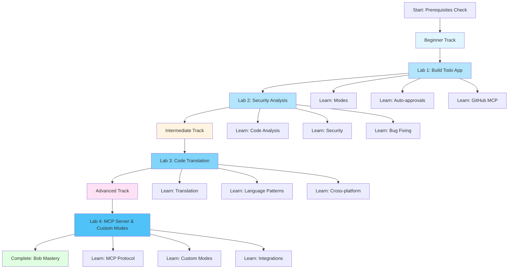
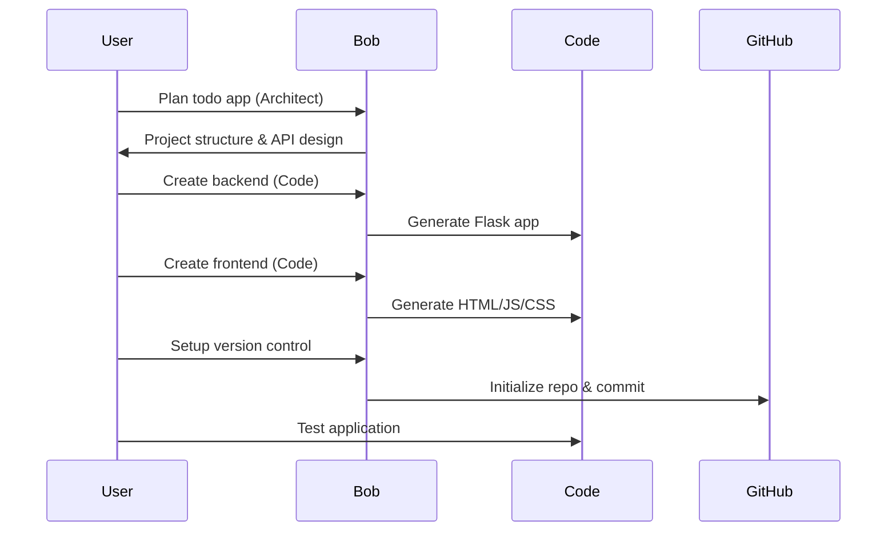
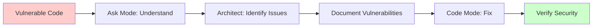
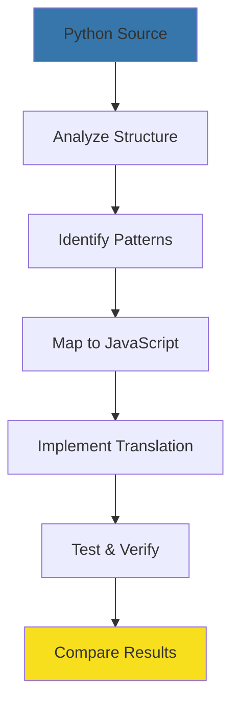
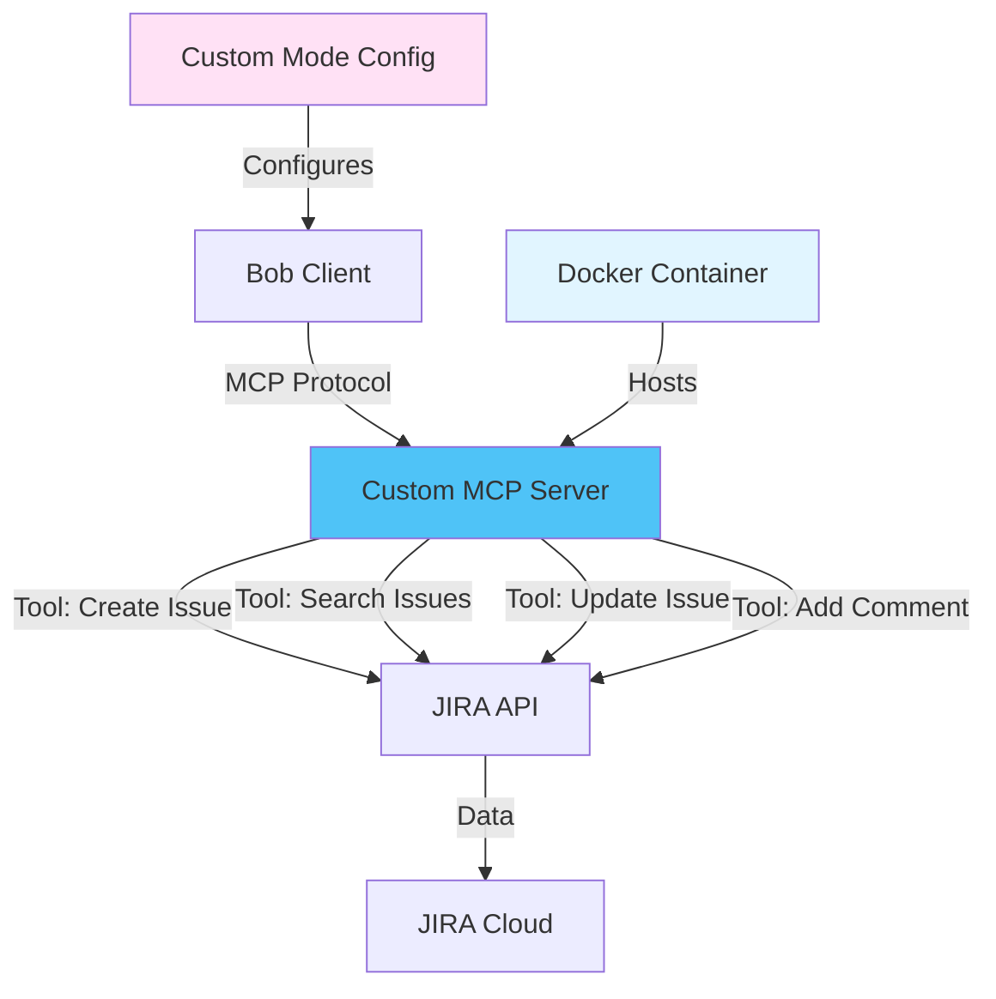
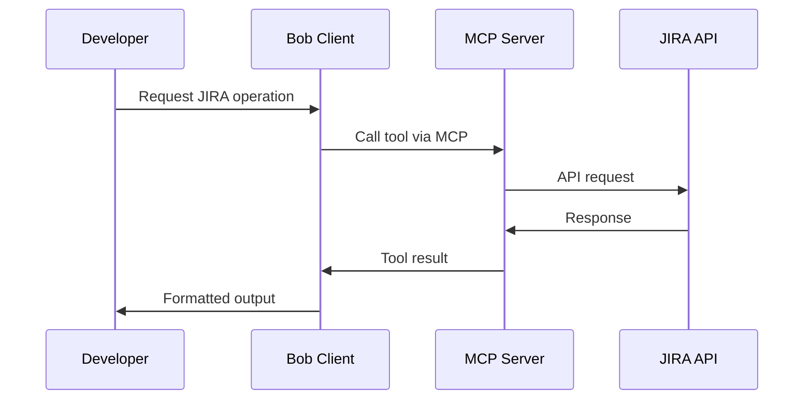
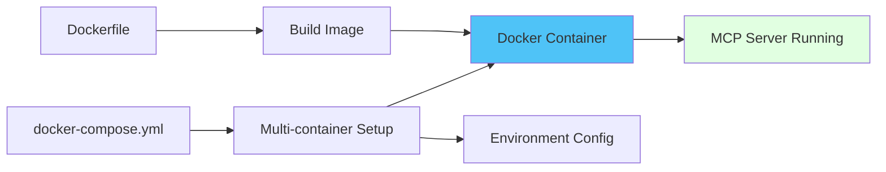
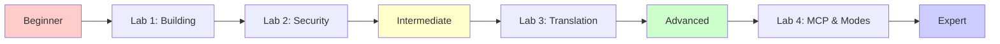

# Bob Bootcamp Labs - Visual Overview

## Lab Journey Map



## Lab 1: Building with Bob

### What You'll Build
A full-stack Todo application with Python Flask backend and JavaScript frontend

### Bob Features Showcased
- 🎯 **Plan Mode**: Plan project structure and API design
- 💻 **Code Mode**: Implement backend and frontend
- ❓ **Ask Mode**: Get explanations and guidance
- ⚡ **Auto-approvals**: Rapid development workflow
- 📝 **Literate Coding**: Self-documenting code
- 🔗 **GitHub MCP**: Version control integration

### Technology Stack
```
Frontend:          Backend:           Tools:
- HTML5            - Python 3.8+      - Bob AI
- CSS3             - Flask            - Git/GitHub
- JavaScript       - SQLite           - MCP Servers
```

### Learning Flow


### Key Outcomes
✅ Functional todo application  
✅ Understanding of Bob modes  
✅ Experience with auto-approvals  
✅ GitHub integration knowledge  
✅ Full-stack development skills  

---

## Lab 2: Security & Analysis

### What You'll Analyze
A vulnerable todo application with intentional security flaws

### Bob Features Showcased
- ❓ **Ask Mode**: Understand existing code
- 🎯 **Plan Mode**: Plan security fixes
- 💻 **Code Mode**: Implement fixes
- 🔍 **Code Analysis**: Multi-file understanding
- 🛡️ **Security Awareness**: Vulnerability detection

### Vulnerabilities Included
```
1. SQL Injection
   Location: Backend database queries
   Risk: High
   
2. Cross-Site Scripting (XSS)
   Location: Frontend DOM manipulation
   Risk: High
   
3. Hardcoded Secrets
   Location: Configuration files
   Risk: Critical
   
4. Missing Input Validation
   Location: API endpoints
   Risk: Medium
```

### Analysis Flow


### Security Fixes Applied
| Vulnerability | Fix Applied |
|--------------|-------------|
| SQL Injection | Parameterized queries |
| XSS | Input sanitization & textContent |
| Hardcoded Secrets | Environment variables |
| Input Validation | Schema validation |

### Key Outcomes
✅ Security vulnerability identification  
✅ Understanding of common attacks  
✅ Secure coding practices  
✅ Code analysis skills  
✅ Fix implementation experience  

---

## Lab 3: Code Translation

### What You'll Translate
A Python data processing script to JavaScript

### Bob Features Showcased
- ❓ **Ask Mode**: Analyze source code
- 🎯 **Plan Mode**: Plan translation strategy
- 💻 **Code Mode**: Implement translation
- 🔄 **Language Expertise**: Cross-language patterns
- 📚 **Documentation**: Maintain clarity

### Translation Challenge
```
Source Language:        Target Language:
Python 3.8+            Node.js JavaScript
- Type hints           - JSDoc comments
- List comprehensions  - Array methods
- Context managers     - Promises/async
- Built-in CSV         - csv-parser library
```

### Translation Process


### Pattern Mapping Examples

#### List Comprehension
```python
# Python
values = [float(row[field]) for row in self.data]
```
```javascript
// JavaScript
const values = this.data.map(row => parseFloat(row[field]));
```

#### File Operations
```python
# Python
with open(filename, 'r') as file:
    data = file.read()
```

---

## Lab 4: MCP Server & Custom Modes

### What You'll Build
Custom MCP server with JIRA integration and specialized DevOps mode

### Bob Features Showcased
- 🔌 **MCP Protocol**: Server development
- 🛠️ **Custom Tools**: External integrations
- 🎨 **Custom Modes**: Specialized workflows
- 🐳 **Docker Deployment**: Production setup
- 🔗 **API Integration**: Third-party services

### Technology Stack
```
Server:             Integration:       Deployment:
- Node.js           - JIRA API         - Docker
- MCP Protocol      - REST APIs        - Docker Compose
- Express           - OAuth            - Environment vars
```

### MCP Architecture


### MCP Server Development Flow


### Custom Tools Implemented

#### 1. Create JIRA Issue
```javascript
{
  name: "create_jira_issue",
  description: "Create a new JIRA issue",
  parameters: {
    project: "Project key",
    summary: "Issue summary",
    description: "Issue description",
    issueType: "bug | story | task"
  }
}
```

#### 2. Search Issues
```javascript
{
  name: "search_jira_issues",
  description: "Search JIRA issues with JQL",
  parameters: {
    jql: "JQL query string",
    maxResults: "Maximum results to return"
  }
}
```

#### 3. Update Issue
```javascript
{
  name: "update_jira_issue",
  description: "Update an existing JIRA issue",
  parameters: {
    issueKey: "Issue key (e.g., PROJ-123)",
    fields: "Fields to update"
  }
}
```

### Custom Mode Configuration

#### DevOps Mode Features
```json
{
  "name": "DevOps Mode",
  "slug": "devops",
  "systemPrompt": "Specialized for DevOps workflows",
  "tools": [
    "create_jira_issue",
    "search_jira_issues",
    "deploy_application",
    "check_pipeline_status"
  ],
  "preferences": {
    "codeStyle": "infrastructure-as-code",
    "focus": "automation and deployment"
  }
}
```

### Docker Deployment


### Key Outcomes
✅ MCP protocol understanding  
✅ Custom server development  
✅ External API integration  
✅ Custom mode creation  
✅ Docker deployment skills  

```javascript
// JavaScript
const data = await fs.promises.readFile(filename, 'utf8');
```

#### Class Structure
```python
# Python
class DataProcessor:
    def __init__(self, filename: str):
        self.filename = filename
```
```javascript
// JavaScript
class DataProcessor {
    constructor(filename) {
        this.filename = filename;
    }
}
```

### Key Outcomes
✅ Code translation skills  
✅ Language pattern understanding  
✅ Cross-platform development  
✅ Async/await mastery  
✅ Best practices in both languages  

---

## Overall Learning Progression

### Skill Development Path


### Bob Mode Mastery
| Mode | Lab 1 | Lab 2 | Lab 3 | Lab 4 | Total Usage |
|------|-------|-------|-------|-------|-------------|
| Plan | ⭐⭐⭐ | ⭐⭐ | ⭐⭐⭐ | ⭐⭐ | High |
| Code | ⭐⭐⭐ | ⭐⭐⭐ | ⭐⭐⭐ | ⭐⭐⭐ | Very High |
| Ask | ⭐ | ⭐⭐⭐ | ⭐⭐ | ⭐ | Medium |

### Time Investment
```
Lab 1: Building          ████████████░░░░░░░░ 45 min
Lab 2: Security          ████████████░░░░░░░░ 45 min
Lab 3: Translation       ████████████░░░░░░░░ 45 min
Lab 4: MCP & Modes       ████████████████░░░░ 60 min
                         ─────────────────────
Total Learning Time:     ████████████████████ 3h 15min
```

### Competency Matrix

After completing all labs, you will be able to:

| Skill | Proficiency |
|-------|-------------|
| Bob Mode Switching | ⭐⭐⭐⭐⭐ Expert |
| Auto-approvals | ⭐⭐⭐⭐⭐ Expert |
| Code Generation | ⭐⭐⭐⭐ Advanced |
| Security Analysis | ⭐⭐⭐⭐ Advanced |
| Code Translation | ⭐⭐⭐⭐ Advanced |
| GitHub Integration | ⭐⭐⭐ Intermediate |
| Literate Coding | ⭐⭐⭐⭐ Advanced |
| MCP Servers | ⭐⭐⭐⭐ Advanced |
| Custom Modes | ⭐⭐⭐⭐ Advanced |

---

## Prerequisites Checklist

### Required Software
- [ ] Python 3.8 or higher
- [ ] Node.js 14 or higher
- [ ] Git 2.x or higher
- [ ] Bob installed and configured
- [ ] Text editor or IDE (VS Code recommended)

### Required Knowledge
- [ ] Basic Python syntax
- [ ] Basic JavaScript syntax
- [ ] HTML/CSS fundamentals
- [ ] REST API concepts
- [ ] Git basics
- [ ] Command line usage

### Optional but Helpful
- [ ] Flask framework familiarity
- [ ] SQL basics
- [ ] Security concepts
- [ ] Async programming

### Account Setup
- [ ] GitHub account created
- [ ] Bob account configured
- [ ] GitHub MCP server connected

---

## Quick Start Guide

### 1. Verify Prerequisites
```bash
python --version    # Should be 3.8+
node --version      # Should be 14+
git --version       # Should be 2.x+
```

### 2. Clone Repository
```bash
git clone <repository-url>
cd bootcamp_intro_lab
```

### 3. Start with Lab 1
```bash
cd lab1
# Follow instructions in lab1/README.md
```

### 4. Progress Through Labs
- Complete Lab 1 before moving to Lab 2
- Complete Lab 2 before moving to Lab 3
- Take breaks between labs to absorb concepts

### 5. Get Help
- Review troubleshooting guide in `resources/troubleshooting.md`
- Check Bob features guide in `resources/bob-features-guide.md`
- Use Ask mode in Bob for questions

---

## Success Indicators

### You're Ready to Move On When:

**After Lab 1:**
- ✅ You can switch between Bob modes confidently
- ✅ Your todo app runs without errors
- ✅ You understand auto-approvals
- ✅ Your code is on GitHub

**After Lab 2:**
- ✅ You can identify security vulnerabilities
- ✅ You understand SQL injection and XSS
- ✅ You've fixed all security issues
- ✅ You can explain secure coding practices

**After Lab 3:**
- ✅ You've successfully translated Python to JavaScript
- ✅ Both versions produce identical output
- ✅ You understand language-specific patterns
- ✅ You can explain translation decisions

**After Lab 4:**
- ✅ Custom MCP server is running
- ✅ JIRA integration works
- ✅ Custom mode is configured
- ✅ Server deployed with Docker

---

## Next Steps After Completion

### Continue Learning
1. **Build Your Own Project**: Apply Bob to a personal project
2. **Explore More MCP Servers**: Try additional integrations
3. **Advanced Security**: Deep dive into OWASP Top 10
4. **Performance Optimization**: Use Bob for code optimization
5. **Team Collaboration**: Use Bob in team settings

### Share Your Experience
- Write a blog post about your learning journey
- Share your completed projects on GitHub
- Help others in the Bob community
- Provide feedback on the labs

### Certification Path
- Complete all four labs
- Build a capstone project
- Demonstrate Bob proficiency
- Earn Bob Developer certification

---

## Support & Resources

### Documentation
- Main README: Project overview
- Lab READMEs: Detailed instructions
- Architecture docs: Technical details
- Troubleshooting: Common issues

### Community
- Bob Community Forum
- GitHub Discussions
- Stack Overflow (tag: bob-ai)
- Discord Server

### Additional Learning
- Bob Official Documentation
- Security Best Practices Guide
- Python to JavaScript Translation Guide
- MCP Server Development Guide

---

## Feedback Welcome!

We're constantly improving these labs. Please share:
- What worked well
- What was confusing
- Suggestions for improvement
- Additional topics you'd like covered

Contact: [feedback email or form]

---

**Ready to start? Head to Lab 1 and begin your Bob journey!** 🚀