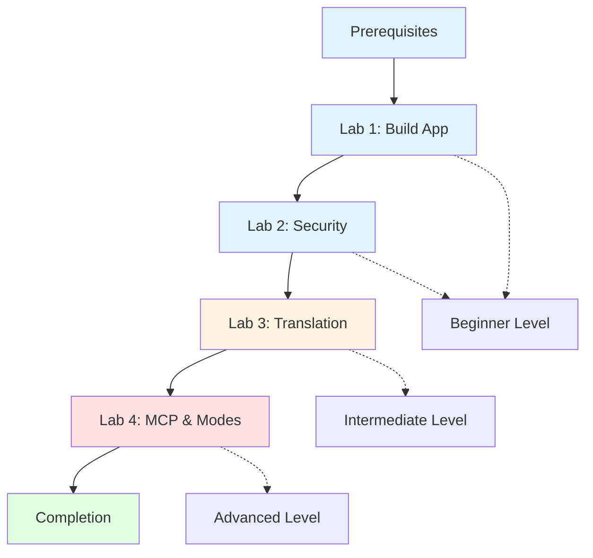

# Bob on Tour: Hands-On Labs

Welcome to the Bob on Tour hands-on labs! This comprehensive training series will teach you how to leverage IBM Bob's AI-powered development capabilities through practical, real-world exercises.

## 🎯 Overview

These labs are designed to give you hands-on experience with Bob's core features through four progressive exercises:

1. **Lab 1: Building Applications** - Create a full-stack todo application
2. **Lab 2: Security & Code Analysis** - Identify and fix security vulnerabilities
3. **Lab 3: Code Translation** - Translate Python code to JavaScript
4. **Lab 4: MCP & Custom Modes** - Create custom tools and modes

**Total Learning Time**: 4~ hours

## 🚀 What You'll Learn

### Bob's Core Features
- **Multiple Modes**: Plan, Code, and Ask modes for different tasks
- **Auto-approvals**: Rapid development with automated confirmations
- **Literate Coding**: Self-documenting code with inline explanations
- **MCP Servers**: Integration with GitHub and custom services
- **BobShell**: Command-line interface and automation
- **Code Analysis**: Understanding and improving existing codebases
- **Security Awareness**: Identifying and fixing vulnerabilities
- **Code Translation**: Converting code between languages
- **Custom Modes**: Creating specialized Bob modes
- **MCP Development**: Building custom MCP servers

### Technical Skills
- Full-stack web development (Python Flask + JavaScript)
- REST API design and implementation
- Security best practices (SQL injection, XSS, secrets management)
- Cross-language development patterns
- MCP server development
- Custom mode creation

## 📋 Prerequisites

Before starting these labs, ensure you have:

### Required Software
- **Python 3.8+** - [Download](https://www.python.org/downloads/)
- **Node.js 14+** - [Download](https://nodejs.org/)
- **Git 2.x+** - [Download](https://git-scm.com/)
- **Bob** - [Download](https://bob.ibm.com/download/)
- **Text Editor/IDE** - VS Code recommended

### Required Knowledge
- Basic Python syntax and concepts
- Basic JavaScript syntax and concepts
- HTML/CSS fundamentals
- REST API concepts
- Git basics
- Command line usage

### Account Setup
- GitHub account (for Lab 1)
- Bob account configured
- GitHub MCP server connected (optional but recommended)

For detailed setup instructions, see [prerequisites.md](prerequisites.md).

## 📚 Lab Structure

### ⚠️ Important: Open Labs in Separate Workspaces

For the best experience with Bob, **open each lab as a separate workspace** after cloning:

```bash
# First, clone the repository
git clone <repository-url>
cd bob-on-tour
```

**Then open the specific lab folder in Bob:**

1. Open Bob
2. Click **File → Open Folder** (or **File → Open...** on macOS)
3. Navigate to the `bob-on-tour` directory
4. Select the specific lab folder (e.g., `lab1`, `lab2`, `lab3`, or `lab4`)
5. Click **Open**

**Why open individual lab folders?**
- ✅ Bob focuses on the correct lab context
- ✅ No confusion with files from other labs
- ✅ Better performance and clearer workspace

---

### 🟢 Beginner Track (Labs 1-2)

#### Lab 1: Building a Todo Application (45 minutes)
**Focus**: Creation and Development

Learn to use Bob's different modes to build a complete full-stack application from scratch.

**What You'll Build**:
- Python Flask REST API backend
- JavaScript frontend with modern UI
- SQLite database integration
- GitHub repository with version control

**Bob Features**:
- ✅ Plan Mode for planning
- ✅ Code Mode for implementation
- ✅ Auto-approvals for rapid development
- ✅ Literate coding for documentation
- ✅ GitHub MCP for version control

**[Start Lab 1 →](lab1/README.md)**

---

#### Lab 2: Security Analysis & Fixes (60 minutes)
**Focus**: Code Analysis and Security

Use Bob to analyze existing code, identify security vulnerabilities, and implement fixes.

**What You'll Analyze**:
- SQL injection vulnerabilities
- Cross-site scripting (XSS) issues
- Hardcoded secrets and credentials
- Input validation problems

**Bob Features**:
- ✅ Ask Mode for code understanding
- ✅ Plan Mode for analysis and planning
- ✅ Code Mode for implementing fixes
- ✅ Multi-file code analysis
- ✅ Security best practices

**[Start Lab 2 →](lab2/README.md)**

---

### 🟡 Intermediate Track (Lab 3)

#### Lab 3: Code Translation (45 minutes)
**Focus**: Cross-Language Development

Learn to translate code between languages while maintaining functionality and best practices.

**What You'll Translate**:
- Python data processing script
- File I/O operations
- Statistical calculations
- JSON export functionality

**Bob Features**:
- ✅ Ask Mode for code analysis
- ✅ Plan Mode for translation planning
- ✅ Code Mode for implementation
- ✅ Language-specific patterns
- ✅ Documentation maintenance

**[Start Lab 3 →](lab3/README.md)**

---

### 🔴 Advanced Track (Lab 4)

#### Lab 4: Creating MCP Server & Custom Mode (90 minutes)
**Focus**: Extensibility and Customization

Build your own MCP server and create a custom Bob mode for specialized tasks.

**What You'll Create**:
- Custom MCP server with tools
- Server resources
- Custom Bob mode configuration
- Tool integration
- Deployment setup

**Bob Features**:
- ✅ MCP protocol understanding
- ✅ Server development
- ✅ Custom mode creation
- ✅ Tool implementation
- ✅ Integration testing

**[Start Lab 4 →](lab4/README.md)**

---

## 🗺️ Learning Path



### Recommended Progression
1. **Complete prerequisites** - Ensure all software is installed
2. **Labs 1-2 (Beginner)** - Build foundational understanding
3. **Lab 3 (Intermediate)** - Expand your skills
4. **Lab 4 (Advanced)** - Master advanced techniques
5. **Review and practice** - Apply to your own projects

### Time Commitment
- **Lab 1**: 45 minutes
- **Lab 2**: 60 minutes
- **Lab 3**: 45 minutes
- **Lab 4**: 90 minutes
- **Total**: ~4 hours (including breaks)

## 📖 Additional Resources

### Documentation
- [Prerequisites & Setup](prerequisites.md) - Detailed setup instructions
- [Architecture Overview](ARCHITECTURE.md) - Technical architecture details
- [Visual Overview](LAB_OVERVIEW.md) - Diagrams and visual guides

### Reference Guides
- [Bob Features Guide](resources/bob-features-guide.md) - Quick reference
- [MCP Servers Guide](resources/mcp-servers-guide.md) - MCP integration
- [Troubleshooting](resources/troubleshooting.md) - Common issues

### Support
- Bob Documentation - Official docs
- Community Forum - Ask questions
- GitHub Issues - Report problems

## ✅ Success Criteria

You'll know you've successfully completed the bootcamp when you can:

### After Labs 1-2 (Beginner)
- [ ] Switch confidently between Bob's different modes
- [ ] Use auto-approvals effectively for rapid development
- [ ] Apply literate coding principles to your code
- [ ] Integrate GitHub MCP for version control
- [ ] Identify common security vulnerabilities
- [ ] Implement security fixes properly

### After Lab 3 (Intermediate)
- [ ] Translate code between languages
- [ ] Maintain functionality across language boundaries
- [ ] Apply language-specific best practices
- [ ] Apply Bob to your own projects

### After Lab 4 (Advanced)
- [ ] Create custom MCP servers
- [ ] Design custom Bob modes
- [ ] Integrate Bob into complex workflows
- [ ] Extend Bob's capabilities

## 🎓 What's Next?

After completing these labs, you can:

1. **Apply to Real Projects**: Use Bob on your own development work
2. **Explore Advanced Features**: Dive deeper into Bob's capabilities
3. **Join the Community**: Share your experience and help others
4. **Build Your Portfolio**: Showcase your Bob-powered projects
5. **Continue Learning**: Explore additional MCP servers and integrations
6. **Create Custom Tools**: Build your own MCP servers and modes
7. **Contribute**: Help improve Bob and its ecosystem

## 🤝 Contributing

Found an issue or have a suggestion? We welcome contributions!

- Report bugs via GitHub Issues
- Submit improvements via Pull Requests
- Share feedback in the Community Forum
- Help other learners in discussions

## 📝 License

This educational content is provided for learning purposes. Please refer to the LICENSE file for details.

## 🙏 Acknowledgments

Created with ❤️ using Bob to demonstrate Bob's capabilities.

Special thanks to the Bob development team and the community for their support.

---

## Quick Start

Ready to begin? Here's how to get started:

0. **Open Individual Lab Folder (Important!)**
   
   For the best experience with Bob, open each lab as a separate workspace:
   
   1. Open Bob
   2. Click **File → Open Folder** (or **File → Open...** on macOS)
   3. Navigate to `bob-on-tour` directory
   4. Select the specific lab folder (e.g., `lab1`, `lab2`, `lab3`, or `lab4`)
   5. Click **Open**
   
   **Why?** Opening individual lab folders ensures:
   - Bob focuses on the correct lab context
   - No confusion with files from other labs
   - Better performance and clearer workspace

1. **Verify Prerequisites**
   ```bash
   python --version    # Should be 3.8+
   node --version      # Should be 14+
   git --version       # Should be 2.x+
   ```

2. **Clone or Download**
   ```bash
   git clone <repository-url>
   cd bob-on-tour
   ```

3. **Start Lab 1**
   ```bash
   cd lab1
   # Follow instructions in lab1/README.md
   ```

4. **Get Help**
   - Check the troubleshooting guide
   - Use Bob's Ask mode for questions
   - Review the documentation

---

## Lab Completion Tracking

Track your progress through the bootcamp:

- [ ] Lab 1: Building Applications ✅
- [ ] Lab 2: Security Analysis ✅
- [ ] Lab 3: Code Translation ✅
- [ ] Lab 4: MCP & Custom Modes ✅

**Legend**: ✅ Complete | 🚧 In Progress | ⬜ Not Started

**All labs are now complete and ready for use!**

---

**Ready to start your Bob journey? [Begin with Lab 1 →](lab1/README.md)**

---

*Last Updated: April 2026*
*Version: 2.1 - Streamlined Series*
